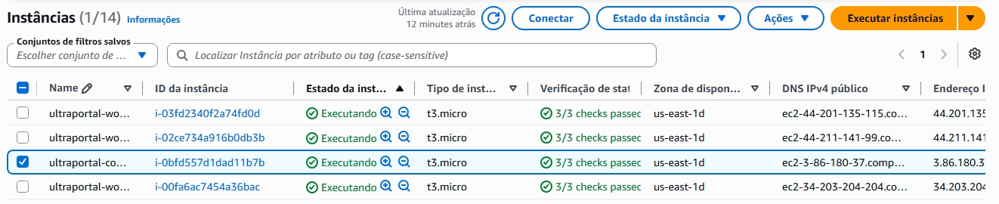

# Modelo de Documento Técnico

### Título: Projeto ULTRAPORTAL – Fundamentos de DevOps

### Aluno: Paulo Cesar Nicolau Padilha

## 1. Introdução

Breve descrição do projeto, objetivos e tecnologias utilizadas.

## 2. Escolha do Ambiente

- **Tipo de ambiente:** Cloud (AWS EC2, via AWS Learner Lab).
- **Justificativa:** O Learner Lab da AWS foi o ambiente utilizado nas aulas do curso e, portanto, foi escolhido para a realização do projeto. A infraestrutura que ele disponibiliza é perfeitamente apropriada e suficiente para a execução do projeto, além de ser gratuita.
- **Instâncias criadas:**
  - 1 instância EC2 t3.micro (Ubuntu 22.04 LTS) "control-plane" que executa o servidor k3s, o ArgoCD e Traefik.
  - 3 instância EC2 t3.micro (Ubuntu 22.04 LTS) "workers" que executam os nós do cluster k3s.

## 3. Provisionamento

### Ferramentas utilizadas

- **Terraform**: utilizado para provisionar as instâncias EC2 na AWS, definir os recursos de rede e exportar os IPs públicos dos nós.
- **Ansible**: utilizado para configurar os servidores após a criação, instalando pacotes básicos, preparando o ambiente SSH e deixando os nós prontos para a instalação do Kubernetes.
- **AWS Learner Lab**: ambiente de laboratório utilizado para executar o projeto sem custo adicional.
- **Git/GitHub**: controle de versão do repositório e acompanhamento das alterações do projeto.

### Scripts criados

- **infra/terraform/main.tf**: definição da infraestrutura da AWS com as instâncias EC2.
- **infra/terraform/variables.tf** e **infra/terraform/terraform.tfvars**: parametrização dos recursos e valores de entrada do provisionamento.
- **infra/ansible/inventory/hosts.ini**: inventário com os hosts do cluster e as configurações de conexão SSH.
- **infra/ansible/playbooks/prepare-servers.yml**: playbook para atualizar o sistema, instalar dependências e preparar os servidores.
- **infra/ansible/group_vars/all.yml**: variáveis compartilhadas utilizadas pelos playbooks do Ansible.

### Desafios e soluções

- Um dos principais desafios foi ajustar o acesso SSH às instâncias, especialmente o problema de permissões da chave privada. A solução foi restringir o acesso da chave no Windows e apontar corretamente o caminho da chave no inventário do Ansible.
- Outro desafio foi garantir que as variáveis do Ansible fossem carregadas corretamente pelos playbooks, o que foi resolvido com a inclusão do arquivo de variáveis compartilhadas no playbook de preparação dos servidores.

## 4. Cluster Kubernetes

Ferramenta usada para instalar o cluster
Configuração dos nós
Testes de funcionamento

## 5. GitOps com ArgoCD

Instalação do ArgoCD
Configuração do repositório Git
Deploy da aplicação
Screenshots do ArgoCD funcionando

## 6. Aplicação

Descrição da aplicação (ex: FastAPI, banco de dados, etc.)
Como acessar a aplicação no cluster

## 7. Conclusão

Lições aprendidas
Dificuldades encontradas
O que faria diferente

## 8. Link para Repositório
