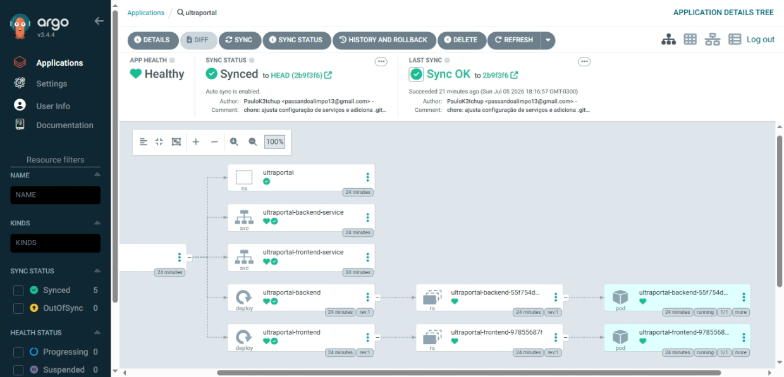
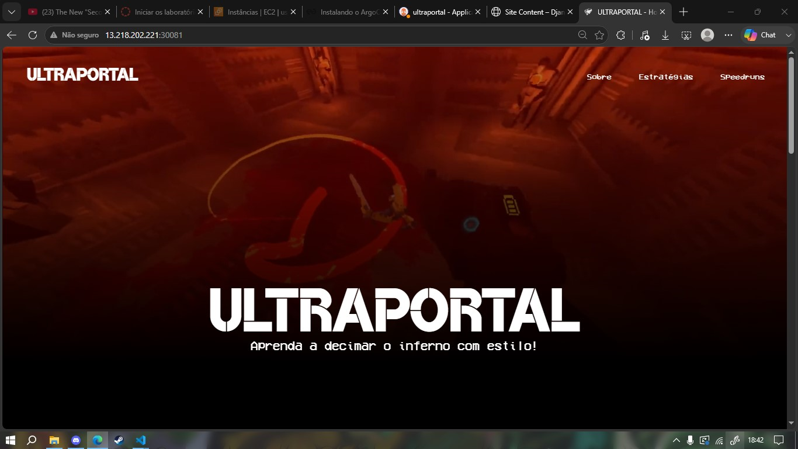
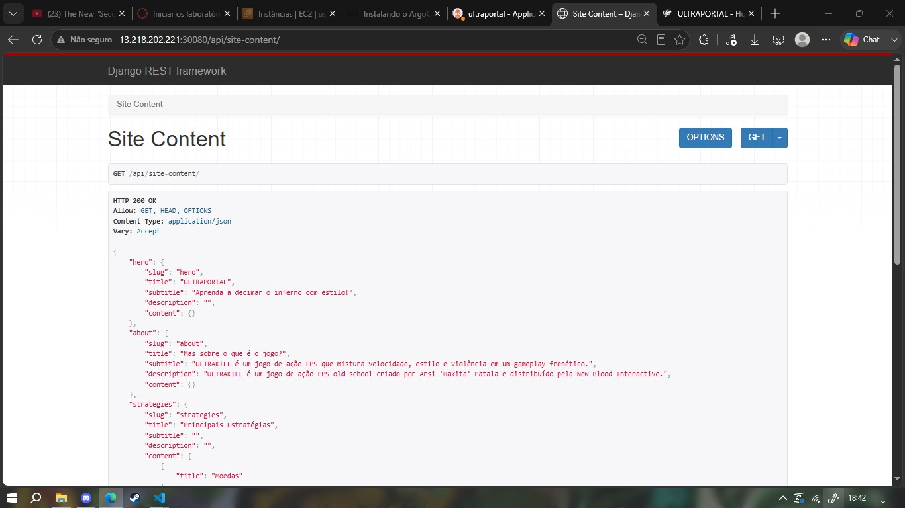

# Modelo de Documento Técnico

### Título: Projeto ULTRAPORTAL – Fundamentos de DevOps

### Aluno: Paulo Cesar Nicolau Padilha

## 1. Introdução

O presente documento técnico descreve o reaproveitamento do projeto ULTRAPORTAL, desenvolvido como um simples experimento de VueJS. O objetivo do projeto foi adaptar o código existente para que a antiga página estática usasse um banco de dados Django para armazenar e exibir os dados de forma dinâmica. Além disso, o projeto foi implantado em um cluster Kubernetes, utilizando o ArgoCD para gerenciar o GitOps e facilitar o processo de deploy da aplicação.

## 2. Escolha do Ambiente

- **Tipo de ambiente:** Cloud (AWS EC2, via AWS Learner Lab).
- **Justificativa:** O Learner Lab da AWS foi o ambiente utilizado nas aulas do curso e, portanto, foi escolhido para a realização do projeto. A infraestrutura que ele disponibiliza é perfeitamente apropriada e suficiente para a execução do projeto, além de ser gratuita.
- **Instâncias criadas:**
  - 1 instância EC2 t3.medium (Ubuntu 22.04 LTS) "control-plane" que executa o servidor k3s e o ArgoCD.
  - 3 instância EC2 t3.medium (Ubuntu 22.04 LTS) "workers" que executam os nós do cluster k3s.


## 3. Provisionamento

### Ferramentas utilizadas

- **Terraform**: utilizado para provisionar as instâncias EC2 na AWS, definir os recursos de rede e exportar os IPs públicos dos nós.
- **Ansible**: utilizado para configurar os servidores após a criação, instalando pacotes básicos, preparando o ambiente SSH e deixando os nós prontos para a instalação do Kubernetes.
- **AWS Learner Lab**: ambiente de laboratório utilizado para executar o projeto sem custo adicional.
- **Git/GitHub**: controle de versão do repositório e acompanhamento das alterações do projeto.

### Scripts criados

- **infra/terraform/main.tf**: definição da infraestrutura da AWS com as instâncias EC2.
- **infra/terraform/variables.tf** e **infra/terraform/terraform.tfvars**: parametrização dos recursos e valores de entrada do provisionamento.
- **infra/ansible/inventory/hosts.ini**: inventário com os hosts do cluster e as configurações de conexão SSH.
- **infra/ansible/playbooks/prepare-servers.yml**: playbook para atualizar o sistema, instalar dependências e preparar os servidores.
- **infra/ansible/group_vars/all.yml**: variáveis compartilhadas utilizadas pelos playbooks do Ansible.

### Desafios e soluções

- Um dos principais desafios foi ajustar o acesso SSH às instâncias, especialmente o problema de permissões da chave privada. A solução foi restringir o acesso da chave no Windows e apontar corretamente o caminho da chave no inventário do Ansible.
- Outro desafio foi garantir que as variáveis do Ansible fossem carregadas corretamente pelos playbooks, o que foi resolvido com a inclusão do arquivo de variáveis compartilhadas no playbook de preparação dos servidores.
- Por estar usando o Windows eu encontrei dificuldades em utilisar o Ansible, minha solução foi criar os scripts localmente mas utilizar eles pela própria instância dentro do AWS, o que me permitiu contornar o problema de compatibilidade do Ansible com o Windows.

## 4. Cluster Kubernetes

- A ferramenta utilizada foi o **k3s**, uma distribuição leve do Kubernetes, que foi instalada no nó "control-plane" e nos nós "workers".

```
NAME              STATUS   ROLES           AGE   VERSION
ip-172-31-85-66   Ready    control-plane   63m   v1.36.2+k3s1
ip-172-31-81-141  Ready    <none>          63m   v1.36.2+k3s1
ip-172-31-89-137  Ready    <none>          63m   v1.36.2+k3s1
ip-172-31-80-253  Ready    <none>          63m   v1.36.2+k3s1
```

## 5. GitOps com ArgoCD

O ArgoCD foi instalado manualmente na máquina control-panel, mas a configuração foi feita por um arquivo yaml disponibilizado no repositório gitops.

Esse arquivo foi aplicado pelo kubectl na máquina control-panel e foi responsável pelo deploy das aplicações no sistema e nas portas necessárias.

Um problema encontrado durante o desenvolvimento foi a disponibilidade das portas, eu estava tentando acessar as páginas sem liberar as portas da aplicação ou do ArgoCD no grupo de segurança, o que foi um grande deslize meu durante a produção desse trabalho.

Mas, no final, o deploy foi um sucesso! A aplicação roda independentemente na porta sem necessidade de um port-forward, embora o ArgoCD precise.



## 6. Aplicação

Como foi mencionado antes, essa aplicação é uma simples página estática, ela serve para mostrar informações de um jogo popular chamado "ULTRAKILL" como uma maneira de introduzir o jogo e ajudar jogadores iniciantes, embora a página seja apenas um teste e não possua muitos detalhes específicos sobre o jogo.

O frontend da aplicação foi desenvolvido com o VueJs, enquanto os dados exibidos na tela são providenciados por um banco de dados Django em backend.

O acesso á página frontend é feito pelo endereço do control-panel na porta "30081"



Enquanto o backend é acessado pelo endereço na porta "30080"



## 7. Conclusão

Muito foi aprendido durante a confecção desse trabalho, principalmente o deploy em si, algo que eu tinha dificuldade em específico.

Minhas maiores dificuldades foram frutos de deslizes meus ou de complicações por causa do sistema operacional que utilizo no meu computador pessoal, mas creio que todas foram superadas no final.

Se eu fosse fazer esse trabalho novamente, eu certamente tentaria automatizar algumas outras coisas nesse processo, sinto que fiz muitas coisas de modo desnecessariamente manual e, consequentemente,acabei perdendo muito tempo e esforço no processo.

No final, creio que tudo tenha dado certo, embora dificuldades tenha aparecido no caminho, eu fiquei satisfeito com os resultados.

## 8. Link para Repositório

[Repositório da aplicação, infraestrutura e relatório](https://github.com/PauloK3tchup/ultraportal-final.git)

[Repositório GitOps](https://github.com/PauloK3tchup/ultraportal-gitops.git)
